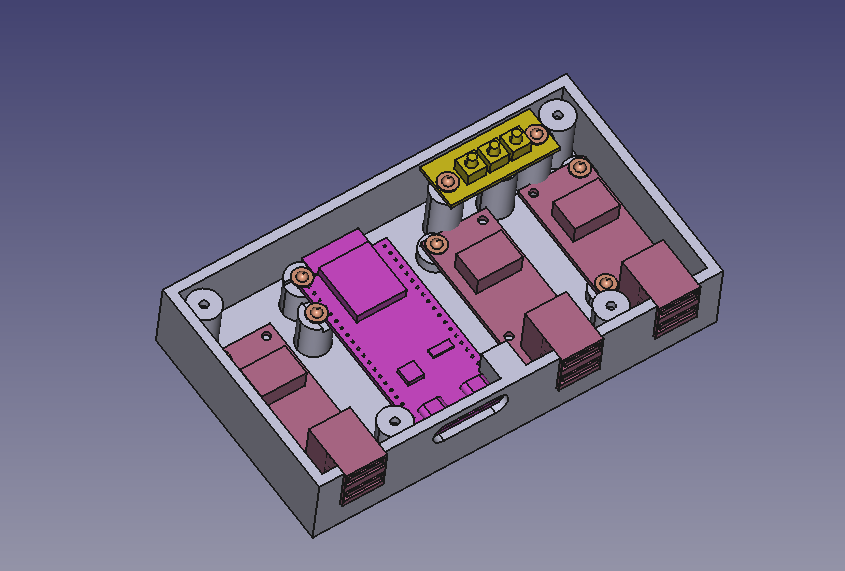
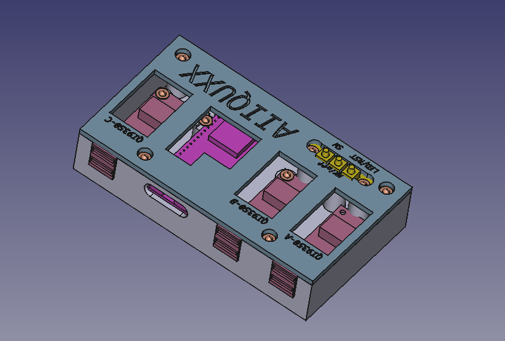
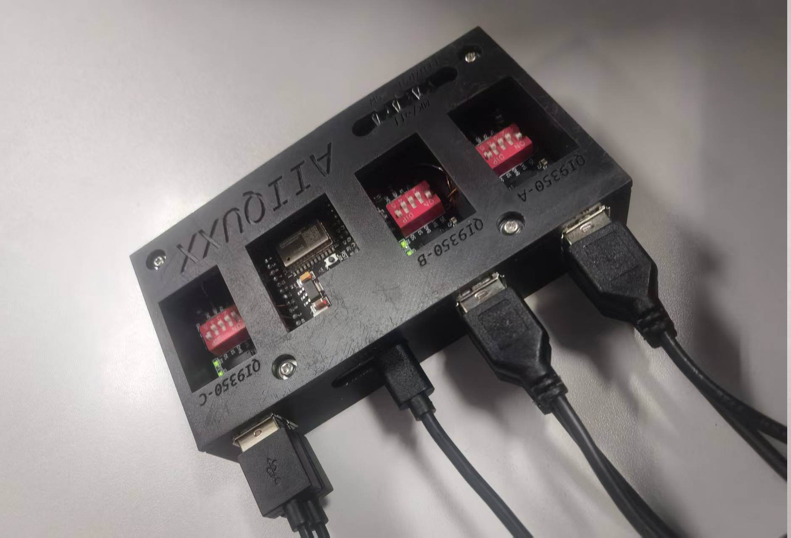

# ESP32-S3 KVM Switch (Dual-Device Keyboard & Mouse Sharing)

## 🌐 Language Switch
- [🔤 English Version (Current)](./README.md)
- [📝 中文版本](./docs/README_zh.md)

---
## 🔤 english-version
### 🚩Project Introduction
A dual-device KVM switch based on ESP32-S3 and CH9350 modules, which enables seamless sharing of a single set of keyboard and mouse between two computers. Equipped with ESP32-S3 on-board RGB-LED light effects to indicate the working status, no driver installation is required, and users without development experience can flash the precompiled firmware with one click. It supports dual-device power supply redundancy design to ensure stable system operation when a single device is powered on.
### ✨Key Features

- Dual-device switching: Supports fast switching of keyboard and mouse between 2 computers (shares one set of keyboard and mouse)
- Two switching methods: Mouse middle button (can be disabled via the K2 button of the 3-position microswitch) or K1 button of the 3-position microswitch
- LED effect indication: Three non-repeating colors of the LED flash in sequence during switching; a blue breathing light indicates Host A, and a red breathing light indicates Host B, with no flicker or abnormal extinction
- Complete core functions: Keyboard and mouse DMA transparent transmission, mouse middle button switching, K1 button switching of the 3-position microswitch, K2 button (on/off) for the mouse middle button function, K3 button short press to control the LED, long press to reset, and no functional degradation after standing idle
- Redundant power supply design: Achieves dual-device power supply mutual backup through Schottky diodes, ensuring stable system operation when a single device is powered on
- ESP-IDF compatibility: Compatible with ESP-IDF v5.5.1, no third-party dependencies, and only uses natively compatible APIs for stable operation
- Driver-free compatibility: Supports all operating systems (Windows/Mac/Linux) that support the USB HID protocol
- One-click flashing: Provides precompiled firmware, no need to build an ESP-IDF development environment

### 🛠️ Hardware List
| Hardware Name | Taobao Link | Quantity | Unit Price (CNY) | Total Amount (CNY) | Shipping Fee (CNY) | Grand Total (CNY) |
|:-------------:|:-----------:|:--------:|:----------------:|:------------------:|:------------------:|:-----------------:|
| ESP32 S3 Core Board (1-N16R8) | [ESP32 S3 Core Board Link](https://item.taobao.com/item.htm?id=715306783664) |     1 | 24.1 | 24.1 | 0 | 24.1 |
| CH9350 Module | [CH9350 Module Link](https://item.taobao.com/item.htm?id=695173316772) |     3 | 18.5 | 55.5 | 3 | 58.5 |
| 3-position Microswitch (with K1/K2/K3 Buttons) | [3-position Microswitch Link](https://item.taobao.com/item.htm?id=550176517768) |     1 | 3.88 | 3.88 | 0 | 3.88 |
| USB OTG Cable (Male to Male) | [USB OTG Cable Link](https://item.taobao.com/item.htm?id=550176517768) |     6 | 0.85 | 5.1 | 2 | 7.1 |
| Through-hole Schottky Diode DO-41 (1N5819 1A 40V) | [Through-hole Schottky Link](https://detail.tmall.com/item.htm?id=781535844592) | 20(use2) | 1.7 | 1.7 | 0 | 1.7 |
| 304 Stainless Steel Pan Head Screw and Nut Set(M2.5x8) | [Head Screw and Nut Set Link](https://detail.tmall.com/item.htm?id=637072501037) | 50(use14) | 4.7 | 4.7 | 0 | 4.7 |
| 3D Printed Case | [3D Printed Case Link](https://www.jlc-3dp.cn/fp/Amntaau/1) |     1 | 24.78 | 24.78 | 3.2 | 27.98 |

### 🔌 Wiring & Assembly

1.Connect the keyboard and mouse to the corresponding USB ports of the CH9350 module respectively

2.Connect the CH9350 module UART port (Host A) to ESP32-S3: TXD→U0RX (GPIO10), RXD→U0TX (GPIO11), GND→GND, 5V→1N5819→5V (ensure stable power supply)

3.Connect the CH9350 module UART port (Host B) to ESP32-S3: TXD→U2RX (GPIO44), RXD→U2TX (GPIO43), GND→GND, 5V→1N5819→5V (ensure stable power supply)

4.Wire the 3-position microswitch: Connect the K1/K2/K3 buttons to the corresponding GPIO pins of the ESP32-S3 respectively

5.Schottky diodes: The anodes of the two diodes are connected to the 5V pins of Host A and Host B respectively, and the cathodes are connected to the 5Vin of ESP32S3 and the 5V pin of Slave C (to ensure effective power supply when one computer is powered on and the entire system can run normally)

6.Organize all components and assemble them into the 3D printed case, fix them firmly to avoid poor contact

#### Wiring Diagrams
##### 1. Power Supply Wiring


      [Host A]                       [Host B]
          |                               |
        5V_OUT                           5V_OUT
          |                               |
          +-----> [D1] +-----+            +-----> [D2] +-----+
          |       (1N5819)   |            |       (1N5819)   |
          |       DO-41      |            |       DO-41      |
          |                  |            |                  |
          +------------------+------------+------------------+
                             |
                        [System 5V Bus]
                             |
                  +----------+-----------+
                  |                      |
            [ESP32S3]                [Slave C]
            5V (Vin)                 5V_IN
           
       [ESP32S3]   [Host A]   [Host B]   [Slave C]   [Microswitch]
          GND ------ GND ------- GND ------- GND ------ GND
            

##### 2. UART & Control Wiring
       [ESP32S3]                  [Host A]
       U0TX (GPIO11) ------------> RXD
       U0RX (GPIO10) <------------ TXD
       
       [ESP32S3]                  [Host B]
       U2TX (GPIO43) ------------> RXD  
       U2RX (GPIO44) <------------ TXD
       
       [ESP32S3]                  [Slave C]
       U1TX (GPIO17) ------------> TXD  
       U1RX (GPIO18) <------------ RXD
       
       [ESP32S3]                  [Microswitch]
       GPIO12 -------------------->(K1) 
       GPIO13 -------------------->(K2) 
       GPIO14 -------------------->(K3) 

### 🚀 One-Click Flashing (No ESP-IDF Required)
#### For Windows Users

1. Download the Espressif ESP Flash Download Tool (recommended to get the latest version from the official website):
   - 🔗 [Official ESP Flash Download Tool](https://docs.espressif.com/projects/esp-test-tools/en/latest/esp32/production_stage/tools/flash_download_tool.html)
   - 📦 [Local Mirror (flash_download_tool.zip)](./firmware/tools/flash_download_tool.zip) (for faster access, same as official latest version)
2. Connect the ESP32-S3 development board to the computer via a USB cable, and select the corresponding COM port (install the dedicated ESP32-S3 USB driver if it is not recognized)
3. Set the flashing parameters: 80MHz / DIO / 2MB (strictly correspond to the firmware configuration to avoid flashing failure)
4. Add firmware files and corresponding flashing addresses:
        - bootloader.bin @ 0x0
        - partition-table.bin @ 0x8000
        - ch9350_led_switch.bin @ 0x10000
5. Click the "START" button on the tool interface to start flashing, and wait for the progress bar to complete (the prompt "FINISH" indicates success)

For detailed address description and parameter verification: firmware/precompiled/flash_addresses.md
### 🎮 How to Use

1. Connect the ESP32-S3 to two target computers via USB cables respectively, ensuring the computers recognize the device normally (no driver prompt is required)
2. Device switching: Press the "mouse middle button" or "K1 button of the 3-position microswitch", the LED will flash three colors in sequence, and the corresponding host breathing light will turn on after completion (blue for Host A, red for Host B)
3. Mouse middle button function control: Press the "K2 button" to switch the on/off status of the mouse middle button switching function (it is recommended to use an LED indicator to distinguish the on/off status)
4. LED control and reset: Short press the "K3 button" to manually control the LED on/off; long press the "K3 button" for more than 3 seconds to reset the device to the initial state

### 🎨 3D Case & CAD Files

 - 3D Models: 3d_models/ (including FreeCAD source files and STL printing files, which can be directly used for 3D printing)
 - 2D Drawings: cad_drawing/ (DWG + DXF formats, which can be used for processing or size modification)

3D Case Rendering:





physical image:


### 🔨 Build from Source (For Developers)

1. Install ESP-IDF v5.5.1 (strictly correspond to the version to avoid compatibility issues)
2. clone repositoryto locate:    `git clone https://github.com/aotebai/esp32-kvm-usb-mouse-keyboard-switcher.git`
3. Enter the project directory and execute the following commands to compile and flash:
```bash
idf.py set-target esp32s3
idf.py build
idf.py -p /dev/ttyUSB0 flash monitor
```
### ❓ Frequently Asked Questions (FAQ)
Q1: Flashing failed / COM port not recognized

A: Install the corresponding USB driver for ESP32-S3; replace with a high-quality USB cable (avoid data cables that only charge without transmitting data); replace the USB port of the computer; ensure the development board enters download mode (operate according to the corresponding key combination).

Q2: No response after assembly, LED not on

A: Check the wiring (especially the power supply line and UART connection, avoid reversing pins); verify that the firmware flashing address is correct; ensure the CH9350 module receives stable 5V power supply and the ESP32-S3 power supply voltage is normal; check if the diode is reversed.

Q3: Switching function is normal, but the keyboard and mouse are not recognized by the computer

A: Confirm that the target computer recognizes the ESP32-S3 as a USB HID device (can be viewed in Device Manager); replace the USB port or USB cable of the computer; update to the latest version of the project firmware, and check whether the communication between the CH9350 module and ESP32-S3 is normal.

Q4: Abnormal LED light effects (flicker, wrong color)

A: Check whether the LED wiring is firm and the pins are corresponding correctly; confirm that the LED control logic in the firmware is consistent with the hardware wiring; try replacing the faulty LED.

Q5: The system cannot work when a single computer is powered on

A: Check if the diode wiring direction is correct (anode connected to host 5V, cathode connected to system bus); confirm that the diode model is 1N5819 (to ensure low forward conduction voltage); check if there is poor contact in the power supply line.

### 📺 Demo Video
Bilibili Demo Link (Replace with your actual video link)
### 📄 Open Source License
Apache License 2.0 (See the LICENSE file in the root directory for details)
